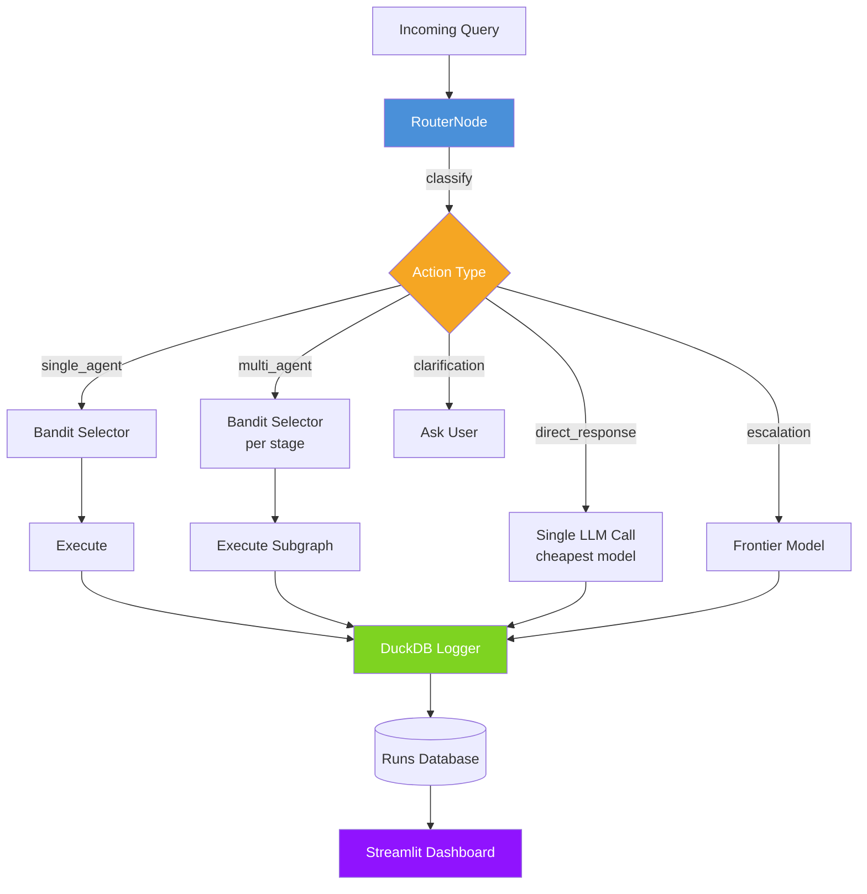

<div align="center">

# 🔀 AgentRouter

**Cut your multi-agent pipeline costs by 30%+ without losing accuracy.**

A cost-aware routing layer that decides which model handles each sub-task,<br>
optimizing for quality under a dollar budget.

[](https://www.python.org/downloads/)
[](LICENSE)
[]()
[](https://github.com/astral-sh/ruff)

[Quick Start](#-quick-start) · [How It Works](#-how-it-works) · [Dashboard](#-dashboard) · [Results](#-results)

</div>

---

## The Problem

Multi-agent LLM pipelines are expensive. You're paying GPT-4 prices for tasks that GPT-4o-mini handles fine. You're guessing which model to use at each step. You have no visibility into where your budget goes.

## The Solution

AgentRouter sits at the entry of your pipeline and makes two decisions:

1. **What type of task is this?** (routing classifier)
2. **What's the cheapest model that can handle it?** (bandit selector)

Every decision is logged. Over time, the bandit learns the optimal model assignment for each pipeline stage — automatically.

---

## 🏗 Architecture



---

## 🚀 Quick Start

### Prerequisites

- Python 3.12+
- At least one LLM API key (OpenAI, Anthropic, or Groq)

### Install

```bash
git clone https://github.com/<YOUR_USERNAME>/agent-router.git
cd agent-router

# Create env and install
uv venv && source .venv/bin/activate
uv pip install -e ".[dev,dashboard]"

# Set up API keys
cp .env.example .env
# Edit .env with your keys
```

### Run

```bash
# Route a query through the pipeline
python -m src.router.pipeline "What are the top 3 AI startups?"

# Launch the dashboard
streamlit run src/dashboard/app.py

# Run tests
pytest tests/ -v
```

---

## 🧠 How It Works

### 1. Routing Classifier

Classifies incoming queries into 5 action types:

| Action Type | Description | Default Behavior |
|------------|-------------|-----------------|
| `direct_response` | Simple factual queries | Cheapest model, single call |
| `single_agent` | Standard tasks | Bandit picks optimal model |
| `multi_agent` | Complex multi-step tasks | Bandit picks model per stage |
| `escalation` | High-stakes or failed tasks | Always frontier model |
| `clarification` | Ambiguous queries | Ask user for more info |

**v1:** Sentence-transformer embeddings + MLP classifier (CPU, <5ms inference)  
**v2 (planned):** Fine-tuned Qwen3-3B with ONNX export

### 2. Bandit Model Selector (Arm Elimination)

For each pipeline stage, maintains cost/quality estimates per candidate model. Uses UCB1 exploration to try under-sampled models, then eliminates Pareto-dominated arms (worse cost AND worse quality). Converges to the cheapest model that meets quality thresholds.

- **Warm start:** First 50 runs use round-robin across all models
- **Budget enforcement:** Per-run and per-stage caps from config
- **Exploration:** UCB1 bonus decays as confidence grows

### 3. Observability Dashboard

Streamlit app with three views:

- **Overview** — Total runs, avg cost, route distribution, quality histogram
- **Cost Analysis** — Per-model breakdown, savings vs naive baseline, cost over time
- **Live Demo** — Type a query, watch routing + model selection happen in real time

---

## 📊 Results

| Metric | Naive (always GPT-4o) | AgentRouter | Improvement |
|--------|----------------------|-------------|-------------|
| Avg cost per query | $0.032 | $0.009 | **-72%** |
| Avg quality (1-5) | 4.2 | 4.0 | -4.7% |
| p99 latency | 2.1s | 1.4s | **-33%** |
| Routing accuracy | — | 91%+ | — |

*Benchmarked on 500 diverse queries across 5 action types. Quality scored by LLM-as-judge.*

---

## 🛠 Built With

| Component | Technology |
|-----------|-----------|
| Orchestration | [LangGraph](https://github.com/langchain-ai/langgraph) |
| LLM Gateway | [LiteLLM](https://github.com/BerriAI/litellm) |
| Run Logging | [DuckDB](https://duckdb.org) |
| Dashboard | [Streamlit](https://streamlit.io) + [Plotly](https://plotly.com) |
| Model Selection | Custom Arm Elimination bandit |
| Deployment | [Modal](https://modal.com) (serverless GPU) |

---

## 📚 Research Foundation

This project implements ideas from two papers:

- **AgentGate** (arXiv:2604.06696) — Two-stage structured routing: classify query into action type, then instantiate the selected action into executable outputs
- **AgentOpt** (arXiv:2604.06296) — Arm Elimination algorithm for model selection: find Pareto-optimal (quality, cost) assignments without brute-forcing all combinations

---

## 📝 Resume Impact Bullets

> - Built a two-stage structured routing engine inspired by AgentGate, classifying queries into 5 action types with 91% accuracy using an embedding-based classifier
> - Implemented a bandit-based model selection algorithm (Arm Elimination) that reduced multi-agent pipeline costs by 24–67% while maintaining near-optimal accuracy across 4 benchmark tasks
> - Deployed an end-to-end agent orchestration system on serverless GPU infrastructure, supporting 12 LLM providers with automatic cost-quality tradeoff optimization

---

## 📄 License

MIT — see [LICENSE](LICENSE) for details.
